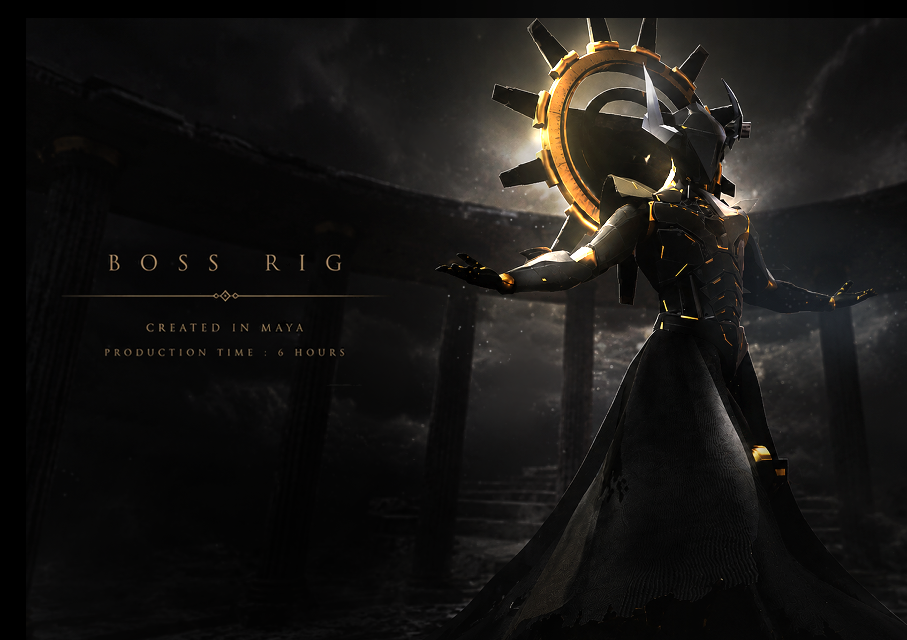
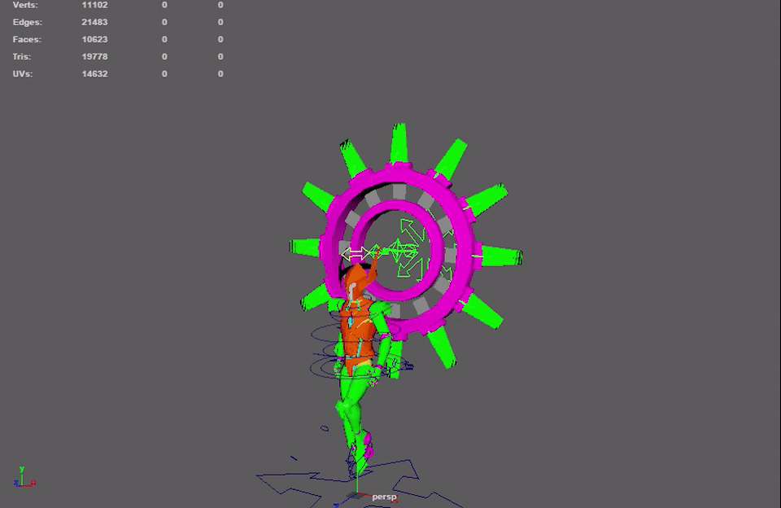
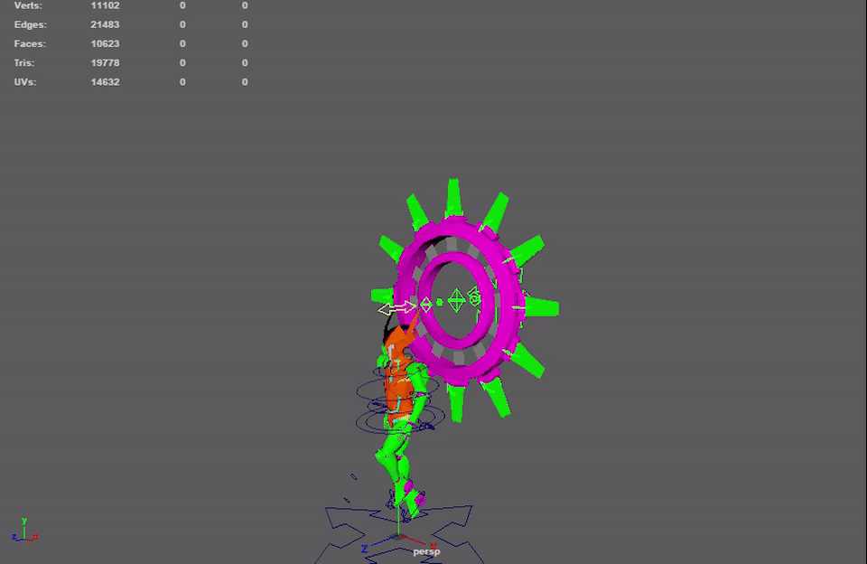
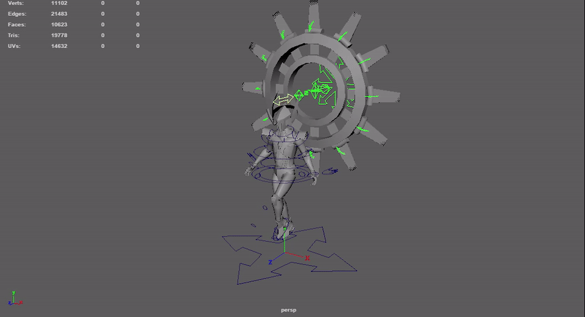
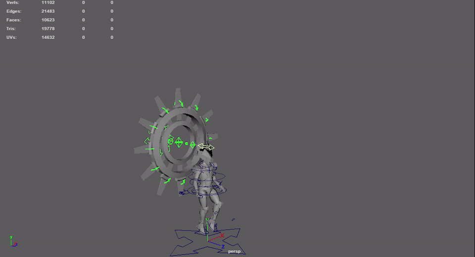
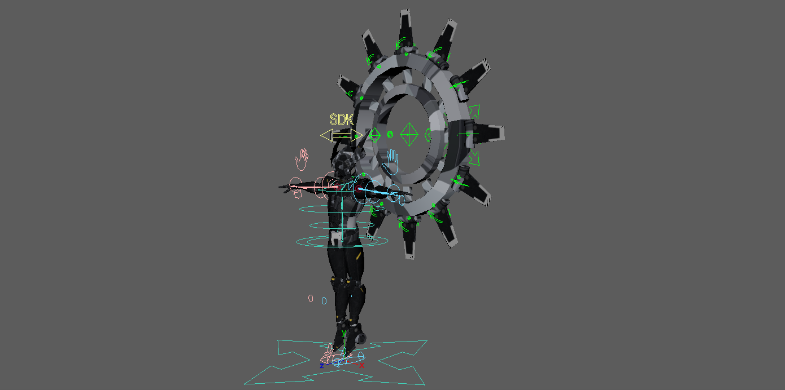
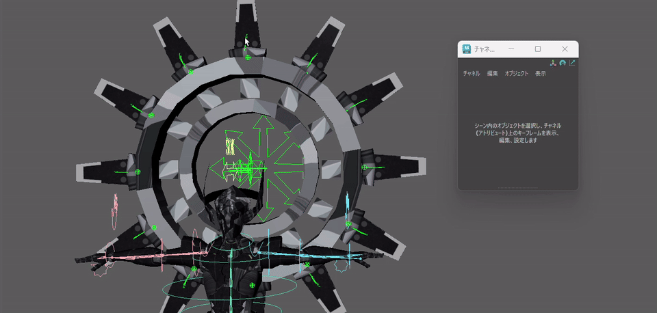

# Boss Character Rig　

Autodesk Mayaで制作した、**非人型ボスキャラクター用のリグ**です。

既存のDiana Character Rigで構築した仕組みをベースとして再利用し、短い制作時間の中で、キャラクター固有の構造とアニメーターからの要望に合わせて調整しました。

---

## Animation Demo
以下のアニメーションは、チーム制作においてアニメーション担当のメンバーが制作したものです。

私はキャラクターのリギングを担当し、アニメーターからの要望をもとに、操作性や可動範囲の調整を行いました。
### Idle

基本姿勢でのリグの変形と、各パーツの追従を確認できます。

### Attack

攻撃モーションで、大きくポーズを変化させた際のリグの挙動を確認できます。

### Small Attack

攻撃動作における各部位の可動と、非人型構造での変形を確認できます。

### Big Beam

大きなアクション時のシルエット変化と、背面を含む各パーツの可動範囲を確認できます。

---

単純に既存リグを流用するのではなく、**非人型キャラクターの構造に合わせたJoint配置・回転軸の調整・SDKの設定**を行い、アニメーション制作で扱いやすいリグを目指しています

---

## Overview

* **Software:** Autodesk Maya2026

* **Rig Type:** Non-Humanoid Character Rig

* **Production Time:** 約6時間

* **Base System:** Diana-Character-Rigをベースに再構築

* **Main Features:**

  * 既存リグシステムの再利用

  * 非人型キャラクターへの構造調整

  * 背面パーツの可動リグ

  * Joint回転軸の調整

  * SDK（Set Driven Key）による補助制御

---

## Rigging Approach

### Existing Rig Reuse

制作時間を短縮するため、以前制作した**Diana Character Rigの構造やリグシステムをベースとして再利用**しました。

すべてを一から構築するのではなく、再利用可能な部分を活用した上で、ボスキャラクター固有の構造に必要な箇所のみを再設計しています。

これにより、既存システムの安定性を活かしながら、短時間でキャラクターに適したリグを構築しました。

---

### Non-Humanoid Structure

モデルの形状と実際に必要となる動きを確認しながら、

* Jointの配置

* Joint Orient

* 回転軸

* Controllerからの操作方向

を調整しました。

特に回転時**各パーツの動作方向を基準に回転軸を設定**しています。

これにより、角度の違うすべてのコントローラーを回転Xによって同じ値で一括制御できるようになっています。
とにかくアニメーターさんの不要な工数を削減できるよう、アニメーション時の操作性を担保しています。

---

## Back Parts Control

アニメーターから、

**「背面に存在するすべてのパーツを動かせるようにしたい」**

という要望があったため、背面パーツにも個別に操作できる仕組みにしています。

モーション仕様を確認して、今回は個別に回転させることがなかったためミス防止のため他の回転軸をロック・非表示にしています。

---

## Set Driven Key

一部の動作には**Set Driven Key（SDK）**を使用しています。後ろのパーツからビームを出すということでその際のアニメーションを一括で制御できるようにしています。

複数のTransformを直接操作する必要がある動作を、Controller側の属性からまとめて制御できるようにすることで、複雑な構造を意識せずアニメーションを作成できるようにしました。

リグ内部の複雑さをアニメーター側へ持ち込まず、**必要な操作をできるだけ少ない入力にまとめること**を意識しています。

---

## Key Points

このリグでは、単にキャラクターを動かせる状態にするだけではなく、

**既存リグの再利用による制作時間の短縮**

**非人型キャラクターへの構造的な対応**

**アニメーターからの要望を反映した操作範囲の設計**

を重視しました。

既存の仕組みをそのまま適用するのではなく、キャラクターとアニメーションの要件を確認し、必要な部分を再設計することで、**約6時間という限られた制作時間の中で実用的なリグを構築**しています。

キャラクター固有のデザインを維持しながら、アニメーション制作側に操作の自由度を残すことを重視しました。

---

## License

MIT License

Copyright (c) 2026 Yuzuki Midoshima
